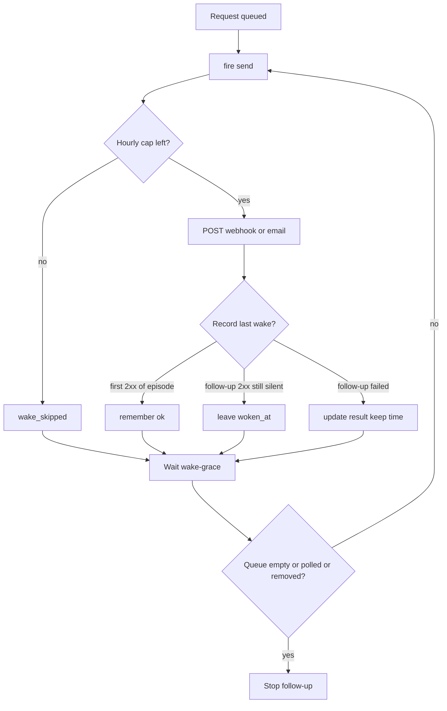

# Wake Follow-Up When the Agent Never Checks In - Plan

---

## Goal Capsule

- Objective: when a wake POST succeeds and the teammate never checks in, the owner and asking agents can tell it never woke, and the relay keeps nudging that teammate on the same path instead of treating the 2xx as done.
- Means: after a request wake, re-arm the same `fire` / `send` path at `--wake-grace`, sharing `MaxPerHour`, until a poll, an empty queue, or removal (KTD1).
- Authority: Requirements (R) win on product behavior; KTDs win on mechanism within their cited Rs; units override neither. This plan supersedes `docs/plans/2026-10-03-1725-feat-unanswered-wake-plan.md` R7 for same-channel request follow-up only. Roster fields and unanswered display from that work stay.
- Stop conditions: stop and ask if the work would call a platform status API, add a second wake method, match on agent names or kinds, add a required `/v1` field, or change the `wakes` table shape. Stop if a unit would touch live-relay discovery (`internal/client/discover.go`).
- Execution profile: Go, agent-tincan only. One implementation PR after this plan is accepted. This document is the plan; it is not the implementation.
- Who finishes: the implementer lands U1-U3 in the code PR; the owner upgrades the relay.
- Open blockers: none.

---

## Product Contract

### Summary

HTTP success on a wake POST means the platform accepted the nudge, not that the agent ran. The relay already marks that gap as unanswered after `--wake-grace`. It does not send again for the still-queued request. After this work, the relay keeps sending on the same webhook or email path until the agent polls, the queue is empty, or the agent is removed, inside the existing hourly cap. Unanswered still dates from the first silent wake on successful and skipped follow-ups. A failed follow-up may update `wake_result` without moving `woken_at`.

### Problem Frame

On 2026-10-04 a teammate queued a request for a webhook agent. The relay POSTed the configured wake URL, received HTTP 2xx, and showed `unanswered="woken 15m ago, no check-in (webhook ok)"`. The agent had not called the relay for about 14 hours. The request stayed `queued`. A wake that did not go through that webhook made the agent check in within a few minutes, claim the request, and reply. It then went idle, which is normal after a turn.

The relay was reachable (tincan 0.11.2). This is not a dead Tailscale address. Live relay discovery (`docs/plans/2026-10-03-1644-feat-live-relay-discovery-plan.md`, PRs 112 and 113) does not apply.

Unanswered reporting already shipped in PR 116 from `docs/plans/2026-10-03-1725-feat-unanswered-wake-plan.md`. That plan's product bar was detect, do not fix, and R7 left wake sending unchanged. `Waker.fire` retries only a failed HTTP send, once, after 5s, reusing the same idempotency key. Reply follow-ups (`retryLater`, 5m / 20m / 1h then stop) run only when unseen replies remain. A request that stays `queued` after a 2xx never re-arms. `Sweep` requeues only after a delivery or claim lease; an agent that never polled never gets a lease. `RequestsWaiting` runs only on relay restart.

README still says wake sending is unchanged and the fix is on the agent's platform. That reading of `webhook ok` is the bug.

### Actors

- A1. Owner: runs the relay, reads `tincan agents`, `tincan top`, and `tincan doctor`.
- A2. Asking agent: queues work with `ask` / `list_agents`.
- A3. Relay-woken agent: wake method `webhook` or `email`.
- A4. Relay waker: sends the configured webhook or email; records last wake; shares `MaxPerHour`.

### Key Decisions

- HTTP 2xx is delivery, not proof of life. Governs R1, R2, R8. (session-settled: user-directed — chosen over treating a successful wake POST as the agent working)
- Follow-up uses the existing webhook or email send path. Governs R3, R7, R10. (session-settled: user-directed — chosen over a second vendor or platform status API)
- Matching is by wake method, never by agent name or kind. Governs R7. (session-settled: user-directed — chosen over special-casing the incident agent)
- This is not live-relay discovery. Governs R3 and Scope Boundaries. (session-settled: user-directed — chosen over treating a silent agent as an unreachable relay)
- Retry in addition to the shipped unanswered mark. Governs R3, R4, R8. Surfacing already exists (PR 116). The gap is that nothing sends again for a still-queued request after 2xx.
- Follow-ups stay unbounded inside `MaxPerHour`, not a three-step ladder. Governs R4. Three `--wake-grace` steps would stop after 30 minutes and would not have covered the 14-hour silent queue. The hourly cap is the bound.

### Requirements

Proof of life

- R1. A wake POST status below 300 means the platform accepted the nudge. It does not mean the agent is working.
- R2. Proof the agent woke is a poll (`GET /v1/poll`, including `peek=1`). Send, get, and whoami do not count.

Follow-up

- R3. After a relay-side request wake, if the agent still has `queued` requests and has not polled since the last recorded wake, the relay sends again on the same method after `--wake-grace` (default 10 minutes).
- R4. Follow-ups continue until the queue is empty, the agent polls, or the owner removes the agent. They do not stop after a fixed number of steps.
- R5. Every real send shares the agent's `MaxPerHour` (default 12). A `wake_skipped` follow-up still re-arms after `--wake-grace`.
- R6. Follow-ups do not move `woken_at` while the agent is still unanswered, so the mark stays dated from the first silent wake. A failed follow-up may update `wake_result` without moving `woken_at`.

Scope of agents

- R7. The behavior applies to wake methods `webhook` and `email` only. Command, wait, channel, none, and schedule are unchanged. No agent name or kind is special-cased.

Reporting

- R8. `tincan agents`, `list_agents`, `tincan top`, `tincan doctor`, and the ask `target` keep the existing unanswered fields. Copy must not read `webhook ok` / `email ok` as the agent working. Operator docs say the relay keeps nudging the same path.

Compatibility

- R9. No new required protocol fields. Older clients ignore today's optional `woken_at`, `wake_result`, and `unanswered`.
- R10. Wake bodies still carry only counts and the fixed instruction. A skipped, failed, or budget-limited follow-up leaves the request queued.

### Key Flows

- F1. Silent after 2xx
  - **Trigger:** A3 has `queued` work. The relay sends a request wake and the POST returns 2xx. A3 does not poll.
  - **Steps:** Unanswered trips after `--wake-grace` (already shipped). The waker sends again on the same URL or email path. It repeats on that interval while work remains queued and no poll has landed, inside `MaxPerHour`.
  - **Outcome:** A3 is woken again. The roster still shows unanswered from the first silent wake. Covered by R1-R6, R8.
- F2. Check-in
  - **Trigger:** A3 polls after a wake, including peek.
  - **Steps:** Unanswered clears. Request follow-ups stop even if some work remains queued. A later `Queued` or `Requeued` event can start a new episode.
  - **Outcome:** No extra nudge for that silent episode. Covered by R2, R4.
- F3. Hourly cap
  - **Trigger:** Real sends in the last hour already equal `MaxPerHour`.
  - **Steps:** The follow-up records `wake_skipped` and does not POST. It re-arms after `--wake-grace`. Last recorded wake is unchanged.
  - **Outcome:** The request stays queued. Unanswered stays. Covered by R5, R10.

### Acceptance Examples

- AE1. Covers R3, R4, R6, R8. Given a webhook agent with one queued request, a 2xx wake at T, and no poll: at T+`--wake-grace` the relay POSTs the same webhook again. The roster still shows unanswered from T (`webhook ok`), not from the follow-up.
- AE7. Covers R6. Given AE1, the next follow-up fails: unanswered still dates from T, and `wake_result` shows the error.
- AE2. Covers R2, R4. Given AE1, the agent then polls: unanswered clears and no further request follow-up is sent for that episode.
- AE3. Covers R5. Given 12 real sends in the current hour, the next follow-up is `wake_skipped` and does not POST. A later follow-up after a slot ages out of the hour POSTs again if still silent and queued.
- AE4. Covers R7. Given a wait, channel, command, or schedule agent with queued work: no request follow-up is added.
- AE5. Covers R6. Given a relay restart while a webhook agent is still unanswered with queued work: `RequestsWaiting` may send after debounce. That 2xx does not move `woken_at`. Unanswered still dates from the first silent wake.
- AE6. Covers R3, R10. Given an email agent with the same silent 2xx pattern: the follow-up is another AgentMail send with the count-only body, sharing `MaxPerHour`.

### Scope Boundaries

Deferred for later

- Alerting the owner outside Tincan when an agent stays unanswered.
- A second wake method or a fallback channel.
- Wake history beyond the last recorded wake.
- Telling the original asker mid-wait that a follow-up was sent.
- Changing `wakeHint` to mention retries (the current line already says not checked in and queued).

Outside this product's identity

- Repairing the agent's own wake receiver or job runner.
- Live relay discovery after a Tailscale address change.
- Calling a platform run-status API.

### Sources / Research

- Issue 122: webhook 2xx, unanswered `webhook ok`, no poll for ~14 hours, request stayed queued; a non-webhook wake produced a check-in.
- Shipped unanswered mark: PR 116, `docs/plans/2026-10-03-1725-feat-unanswered-wake-plan.md` (detect, do not retry).
- Out of scope contrast: PRs 112 and 113, `docs/plans/2026-10-03-1644-feat-live-relay-discovery-plan.md`.
- `internal/wake/wake.go`: `fire`, `retryLater`, `allow`, `remember`, `RequestsWaiting`. Reply follow-ups exist; request follow-ups after 2xx do not.
- `internal/relay/server.go`: `wakeTarget`, `QueuedCount`, `DefaultWakeGrace` (10m). `--wake-grace` is roster-only today (`internal/cli/relay.go`).
- Greptile P0 on `internal/wake`: wake payloads stay counts plus a fixed instruction; a failed or skipped wake must leave the request queued.

---

## Planning Contract

### Key Technical Decisions

- KTD1. Re-arm request follow-up from `fire` the way `retryLater` re-arms unseen replies, on the existing `send` path. The delay is `--wake-grace`, not `DefaultReplyRetries`. Keep re-arming while `Queued` is above zero and there has been no poll since the last recorded wake. Cite R3, R4, R7.
- KTD2. Do not `remember` a 2xx while last poll is still before the last recorded wake. The first 2xx of an episode still `remember`s. A failed follow-up may write `wake_result` without changing `woken_at`. A restart `RequestsWaiting` send follows the 2xx rule, so a bounce does not reset unanswered. Cite R6, AE1, AE5.
- KTD3. Give the waker a last-poll callback in the same shape as `Queued` and `UnseenReplies`, filled from the relay's last-poll map (and the persisted poll when memory is empty). Peek is a poll. Queue-empty and polled-since-last-wake stop checks apply only to `--wake-grace` request follow-up fires, not to `Queued`, `Requeued`, `RequestsWaiting`, OnlineRecheck, or reply-ladder sends. A follow-up-only marker on the nudge is the way to tell those apart; do not reuse `recheck`. Not-relay-side and removed still drop any fire. Cite R2, R4, R5.
- KTD4. One pending nudge per agent still coalesces on `arm`. A fire that serves both a request follow-up and unseen replies may include both counts in `WaitingMessage`. It must not reset the finite reply ladder to step zero. Request-only follow-ups do not start a new reply schedule just because unseen replies happen to remain. Cite R4 and existing `ReplyRetries`.
- KTD5. Each `fire` mints a new idempotency key. The 5s HTTP retry inside that `fire` still reuses the key. A follow-up is a new turn on hosts that key isolation that way. Cite R3, R10.
- KTD6. Add `WakeGrace` to `wake.Options`, default 10 minutes, matching `relay.DefaultWakeGrace`. Pass `f.wakeGrace` at `wake.New`. One flag drives unanswered display and request follow-up. Cite R3.

### High-Level Technical Design

Request follow-up sits next to the existing reply follow-up. Both share `arm`, `fire`, `send`, and `allow`. Unanswered display stays in `Server.wakeTarget` and keeps reading the last recorded wake.

For a `--wake-grace` follow-up fire only, run queue-empty and polled-since-last-wake checks before `allow`. Re-arm the next request follow-up whenever that episode is still silent and queued, including on `wake_skipped`.

### Assumptions

- Email follows the same request follow-up as webhook because `relaySide` already groups them. The incident was webhook-only.
- A duplicate session at 10 minutes is accepted when the first turn has not polled yet. `MaxPerHour` is the bound. Claim stays exclusive.
- Peek stops follow-ups, matching unanswered.
- Ask `wakeHint` stays the current queued / not-checked-in line. Operator docs carry the retry wording.
- No new `wakes` column. Skipping `remember` on silent 2xx follow-ups is enough.
- Lowering `--wake-grace` tightens both the unanswered mark and the follow-up interval against the same cap.

### Risks & Dependencies

- A host that deduplicates identical POST bodies may ignore a follow-up. OpenClaw is covered by KTD5 (new idempotency key per `fire`). If a test shows a generic webhook host drops identical POSTs, stop and ask rather than adding body fields. Generic bodies stay counts plus the fixed instruction (R10).
- Instinct's `max_per_hour: 12` already budgets email resumes. Request follow-ups consume that same budget, including reply nudges.
- `sent` (hourly cap) is in-memory and resets on restart. Restart can send again quickly; KTD2 keeps unanswered from resetting.
- Docs that say the platform is the only actor become wrong for retry and must change in the implementation PR.

---

## Implementation Units

### U1. Request follow-up in the waker

Goal: after a request wake, the waker sends again at wake-grace while work is queued and the agent has not polled.

Requirements: R1-R7, R10; KTD1-KTD5.

Dependencies: none.

Files: `internal/wake/wake.go`, `internal/wake/wake_test.go`, `internal/wake/replies_test.go`, `internal/wake/openclaw_test.go`.

Approach:

1. After `fire` handles a request wake, mark a `--wake-grace` follow-up on the nudge and re-arm at `WakeGrace` when that episode is still silent and queued.
2. Apply KTD2 for last-wake recording. Apply KTD3 poll and queue stop checks only on that follow-up fire, before `allow`.
3. Keep `retryLater` for the reply ladder without resetting it from a request-only follow-up (KTD4).
4. Leave payload, audit events, and queue behavior as they are; a skip or failure must not drop the request. `Queued` / `Requeued` / OnlineRecheck / `RequestsWaiting` still send even if the agent polled after an earlier wake.

Patterns to follow: `retryLater` / `RequestsWaiting`; `TestReplyRetriesWhileUnseenThenStop`, `TestReplyRetriesRespectHourlyCap`, `TestLastWakeIgnoresSkippedWakes`; `TestOpenClawRetryReusesIdempotencyKey` for the in-fire retry only.

Test scenarios:

- Covers AE1. 2xx, still queued, no poll: a second POST after a short `WakeGrace`. Last wake time is the first send.
- Covers AE2. After that first follow-up, a poll then `Flush`: no third POST.
- Queue drains without a poll: no follow-up POST.
- Covers AE3. Cap of 1: first send `woke`, follow-up `wake_skipped` with no POST, last wake unchanged, and a later fire after the hour window POSTs if still silent.
- Covers AE7. Failed follow-up records the error, does not move last wake time, and still re-arms.
- Covers AE6. Email target: second AgentMail send, count-only body, same subject.
- Covers AE4. Wait / channel / command / schedule targets: no POST.
- OpenClaw: follow-up uses a new idempotency key; the 5s HTTP retry inside one `fire` still reuses its key.
- A pending reply retry coalesces with a request follow-up into one POST; the reply ladder does not restart at step zero.
- `Forget` drops the pending follow-up.
- After a poll, a new `Queued` still sends (OnlineRecheck / debounce), and a pending `--wake-grace` follow-up does not.

Verification: the new wake tests fail without the re-arm and pass with it. Existing reply and last-wake tests still pass.

### U2. Wire wake-grace and last poll into the waker

Goal: production construction uses the same grace as unanswered, and follow-ups can see polls.

Requirements: R2, R3, R6; KTD3, KTD6.

Dependencies: U1.

Files: `internal/cli/relay.go`, `internal/cli/relay_flags_test.go`, `internal/relay/server.go`, `internal/relay/unanswered_test.go` if last-wake clock tests need a real follow-up.

Approach:

1. Pass `WakeGrace: f.wakeGrace` into `wake.Options`.
2. Pass a last-poll callback from the relay, using the same memory-then-store rule `wakeTarget` already uses.
3. Default both grace values at 10 minutes and pin that they match.
4. Extend the `--wake-grace` flag help so it names follow-up sending, not only the unanswered mark.

Patterns to follow: existing `Online`, `Queued`, `UnseenReplies`, `ReplyGrace` wiring in `runRelay`.

Test scenarios:

- Covers AE5. Restart path: `RequestsWaiting` plus a persisted unanswered last wake; a 2xx does not move `woken_at`.
- Flag plumbing: `--wake-grace` other than default reaches `wake.Options`.
- Defaults: waker `WakeGrace` equals `relay.DefaultWakeGrace` when unset.

Verification: unanswered tests still match AE1 display (grace from the first silent wake). Flag tests cover the new option field.

### U3. Operator and protocol copy

Goal: docs and doctor no longer say a 2xx wake means the agent is working or that Tincan will not send again.

Requirements: R8, R9.

Dependencies: U1.

Files: `README.md` (Wake methods / unanswered), `docs/protocol.md` (reply-nudge paragraph and roster `woken_at` meaning), `docs/adapters/grokbot.md`, `docs/adapters/e2b.md` if email follow-up is not already implied, `site/agents.txt`, `internal/cli/doctor.go` unanswered fix text, matching doctor tests.

Approach:

1. Replace "Wake sending itself is unchanged" and "The fix is on the agent's own platform, not in Tincan" with: the relay keeps nudging the same path until poll, empty queue, or remove, inside `MaxPerHour`; the owner still has to repair a dead receiver.
2. Protocol: request follow-ups sit next to the 5m / 20m / 1h reply schedule; `woken_at` is the last recorded wake, which does not move on a silent 2xx follow-up.
3. Keep roster token `(webhook ok)` as the send result next to "no check-in".
4. Do not add MCP tools or protocol fields.

Test scenarios:

- Doctor unanswered fix text names same-path retry and that the mark clears on check-in.
- Existing `UnansweredNote` / `wakeHint` tests stay green unless doctor copy assertions change.

Verification: grep of README, protocol, adapters, and `site/agents.txt` no longer claims wake sending is unchanged or that Tincan will not retry.

---

## Verification Contract

| Gate | Command | Applies to |
|---|---|---|
| Tests with race detector | `make test` | U1-U3 |
| Vet | `make vet` | all |
| Lint | `make lint` | all |
| Manual (owner) | With the webhook agent's job paused, ask it: within `--wake-grace` the relay POSTs again, `tincan agents` still shows unanswered from the first wake, and after the job runs the mark clears | R3, R4, R6, R8 |

---

## Definition of Done

- U1-U3 merged in the implementation PR. `make test`, `make vet`, and `make lint` pass.
- AE1-AE7 covered by tests.
- Existing unanswered, reply-retry, hourly-cap, and OpenClaw idempotency tests still pass.
- No agent-name or kind switch in the wake path. No new outbound API host. No change to `internal/client/discover.go`.
- No dead-end code left in the diff.
- Issue 122 closed by that implementation PR, not by this plan PR.
