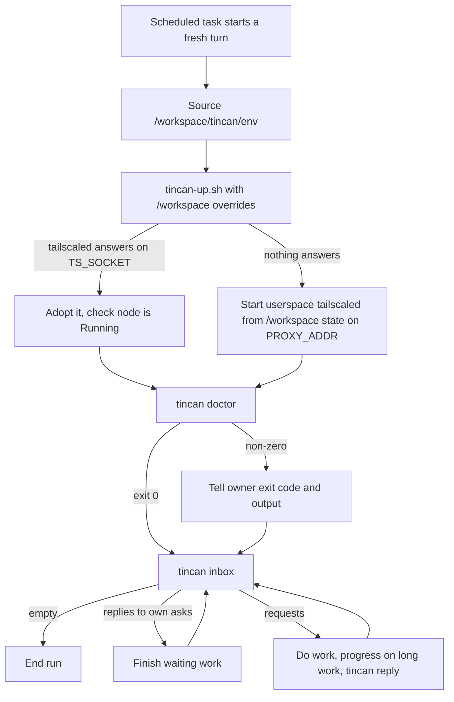
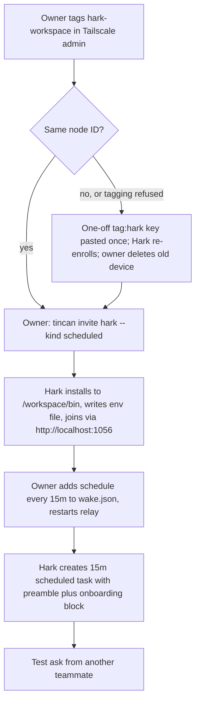

# Hark as a Scheduled Teammate - Plan

## Goal Capsule

- **Objective:** The owner's Tincan teammates can ask Hark (hark.com) for work and get answers on its next scheduled check. The roster says how often Hark checks and flags it when the checks stop. Another Hark user can repeat the setup from the repo's docs alone.
- **Means:** Treat Hark as one more `scheduled` agent (KTD1), make the Grok Bot startup script work in a workspace where only `/workspace` survives (KTD4), and document the whole setup in a Hark adapter guide (U3).
- **Authority:** Product Contract requirements win on behavior. KTDs win on mechanism. Units override neither.
- **Stop conditions:** Stop and ask the owner if a step would put a Tailscale auth key anywhere except one chat message to Hark under KTD2, or if Grok Bot's existing `tincan-up.sh` behavior or tests would have to change.
- **Execution profile:** One shell script and its Go test harness, a one-entry change in `internal/onboard`, and docs. Base the branch on `origin/main`, not the local checkout's older branch.
- **Who finishes:** An implementing agent lands U1 to U3 as one PR to agent-tincan. The owner and Hark run U4 together in Hark's chat once the PR is merged and released.

---

## Product Contract

### Summary

Add Hark as an Agent Tincan teammate using the existing `scheduled` kind and `schedule` wake method that Fo already uses. Let `examples/grokbot/tincan-up.sh` take a different base folder and adopt a Tailscale daemon that is already running, so it can restore Hark's Tailscale after a workspace restart. Map the runtime name `hark` to the scheduled kind, and write `docs/adapters/hark.md` with the join, tagging, wake and standing-instruction steps.

### Problem Frame

Hark is a hosted assistant with a Linux workspace. On 2026-10-06 it installed Tailscale in that workspace and joined the owner's tailnet as `hark-workspace` (100.97.127.52), approved through the owner's browser login. Asked directly, Hark reported:

- Debian 13 arm64 with passwordless sudo.
- Only `/workspace` survives between chats; anything else may be wiped.
- Tailscale runs in userspace mode, with SOCKS5 on `localhost:1055`, an HTTP proxy on `localhost:1056`, and state and socket under `/workspace/tailscale/`.
- No inbound webhook, push API or email trigger can start a turn. Native scheduled tasks can, and each one is a full paid turn.
- Shell commands are capped at 2 minutes in the foreground and 10 minutes in the background.
- Secrets live in a vault that injects them into HTTP requests per host, never as env vars or files.

None of the existing adapter docs fits that shape. Grok Bot wakes on a webhook and keeps its home folder. Fo is scheduled but its doc assumes the default config path in `$HOME`. A Hark node that stays untagged and owned by the owner's login also breaks the trust model's rule that every agent machine is tagged (`docs/trust-model.md`).

### Requirements

**Teammate behavior**

- R1. A teammate's ask to Hark is answered on Hark's next scheduled run. The asker is told Hark checks every 15 minutes and roughly when to expect a reply.
- R2. When Hark's scheduled runs stop, the roster and ask results mark it overdue, as for any scheduled agent.
- R3. Every scheduled run drains Hark's inbox: replies to its own asks, new requests, and progress notes on long work.

**Survives the workspace**

- R4. All Tincan and Tailscale state Hark needs (binary, client config, attachments, Tailscale node identity) lives under `/workspace`, so a workspace restart loses nothing.
- R5. After a workspace restart, the first scheduled run brings Tailscale back as the same node with no login or approval, then continues to the inbox.
- R6. A failed bring-up is reported to the owner in Hark's chat with the exit code and output, and the run still checks the inbox.

**Trust**

- R7. Hark's Tailscale node carries an agent tag and is never an admin device.

**Docs and onboarding**

- R8. `docs/adapters/hark.md` takes a new owner from "Hark is on my tailnet" to "Hark answers teammates", and the README, `docs/adapters/scheduled.md` and `site/agents.txt` link to it.
- R9. An agent named `hark` with no stored kind gets the scheduled-agent onboarding block.

### Key Decisions

- **Hark is a scheduled agent, not a new kind.** Governs R1, R2, R3. (session-settled: user-approved; chosen over a Hark-specific kind or wake method: Hark has no push path, and `scheduled` already models cron-started agents end to end.)
- **Hark's node is tagged.** Governs R7. (session-settled: user-approved; chosen over leaving it untagged and off the admin list: every agent machine is tagged under the trust model.)
- **Check interval is 15 minutes.** Governs R1. (session-settled: user-approved; chosen over a 30-60 minute interval: faster replies are worth the 96 paid turns a day; the owner can raise it later.)

### Success Criteria

- An ask from another teammate to `hark` gets a correct reply within about 20 minutes, with no one typing in Hark's chat.
- A drill that restarts Hark's workspace ends with Hark answering an ask, the same `hark-workspace` device in the Tailscale admin, and no new device waiting for approval.

### Scope Boundaries

- No new wake method. Nothing outside Hark can start a Hark turn today, so Tincan cannot push to it.
- Hark uses the `tincan` CLI from its shell. Registering Tincan as a remote MCP server in Hark is not in this plan.
- No Gmail-polled second wake path.
- Considered and not built: an owner alert when a scheduled agent goes overdue. Overdue shows on the roster and in ask results only, as for Fo. Revisit if Hark goes overdue unnoticed in practice.
- Considered and not built: business-hours scheduling. The relay has no active-hours notion, so a schedule that pauses overnight would show Hark as overdue. Revisit if the cost of overnight runs matters.
- Considered and not built: separate SOCKS5 and HTTP listen addresses in `tincan-up.sh`. The join only uses HTTP, so one `PROXY_ADDR` is enough. Revisit if a Hark tool needs SOCKS5 after a restart.
- Considered and not built: a Hark-specific variant of the generated onboarding block. The doc supplies a short preamble instead (KTD6). Revisit if more workspace-only platforms appear.

### Outstanding Questions

Deferred to execution (U4):

- Does tagging the existing device from the Tailscale admin keep its stable node ID? KTD2 depends on the answer. Record the node ID before and after.
- Does Hark's own approval gate treat `tincan reply` and `tincan ask` as "messaging people" that needs owner OK each time? If so, the doc needs a standing approval line. That line covers only running the `tincan` CLI (inbox, reply, ask, progress) against the relay. Hark's gate stays in place for spending money and messaging people outside Tincan, because teammate requests arrive pre-authorized and Hark's vault holds real credentials.
- Do empty scheduled runs post anything in the owner's Hark chat? This decides how noisy 15 minutes is.
- Does `flock` work on Hark's `/workspace` volume? KTD4 keeps the lock on local disk either way.

---

## Planning Contract

### Key Technical Decisions

- KTD1. **Reuse `scheduled` kind and `schedule` wake with `every: 15m`.** The relay already estimates replies as interval plus 5 minutes and marks overdue at two intervals plus 5 minutes (`docs/adapters/scheduled.md`). No relay or protocol change. Governs R1, R2, R3. (session-settled: user-approved; chosen over a new kind.)
- KTD2. **Tag the existing device from the Tailscale admin before Hark joins Tincan; a one-off key is the fallback.** The owner adds `tag:hark` with "Edit ACL tags" on `hark-workspace`. That needs no key and should keep the node. If it does not, or the tailnet forbids it, the owner makes a one-off, pre-approved, non-ephemeral `tag:hark` key with a one-day expiry and pastes it into Hark's chat once. Hark's vault cannot hold it as an env var, which is the documented Grok Bot path. Tagging comes before `tincan join`, because the relay binds an agent to a node ID and never re-admits a tagged node on its own (`docs/trust-model.md`, rebuilt machines). Governs R7. (session-settled: user-approved; chosen over leaving the node untagged.) Conflict note: `docs/adapters/grokbot.md` says never to put a key in a chat. The doc must say why the fallback is acceptable here (one-off, pre-approved, short expiry, tag-scoped) and that the admin-console route comes first.
- KTD3. **Map runtime name `hark` to the scheduled kind in `runtimeNames`.** It is the first entry whose key differs from its kind value. `resolveKind` already prefers a stored kind, so nothing changes for agents that have one. `tincan invite` does not default a kind from the name, so the doc still says `--kind scheduled`. No stock good-at line: the scheduled kind has none by design and a test pins that.
- KTD4. **Generalize `tincan-up.sh` with overrides that default to today's Grok Bot layout.**
  - Paths: the lib, bin, Tailscale state and cache folders become overridable. With none set, every path is what it is today.
  - Socket: `TS_SOCKET` overrides the socket path. It is the same name the client already reads for relay rediscovery.
  - Adopt mode: when a tailscaled already answers on the configured socket, use it. Do not start a second daemon, kill it, upgrade it, or treat it as a legacy system tailscaled. The `tincan relay --listen` refusal (exit 4) stays unconditional, so Grok Bot behavior does not change.
  - Proxy: unchanged. One `PROXY_ADDR` serves SOCKS5 and HTTP. For Hark it is set to the HTTP address the join uses (KTD5), so a daemon the script starts after a restart serves the same address.
  - Local disk: the lock, log and pid stay on local disk (the cache folder), and only node state goes on `/workspace`. A failed `flock` on a network volume would otherwise read as "already running" and exit 0 silently.
  - Doctor: step 6 runs `tincan doctor` with the caller's `TINCAN_CONFIG`.
- KTD5. **Join through the HTTP proxy, `--proxy http://localhost:1056`.** `http://` is the only scheme the docs, templates and tests use, and relay discovery reads proxy 502/504 as "relay gone". SOCKS5 would work mechanically through Go's `http.ProxyURL`, but it is untested here.
- KTD6. **A small env file under `/workspace` carries per-run settings; the generated onboarding block is used unchanged.** Each scheduled run is a fresh shell with a possibly wiped `$HOME`. So the scheduled-task prompt starts with a preamble that:
  - sources `/workspace/tincan/env` (setting `TINCAN_CONFIG`, `TS_SOCKET`, `PATH`, `PROXY_ADDR`, `TS_HOSTNAME`, `TS_TAGS` and the KTD4 path overrides), because the script's hostname and tag default to `grokbot` and `tag:grokbot`,
  - runs the startup script under a bound shorter than Hark's 2-minute foreground cap, and reports a non-zero exit or a timeout to the owner (R6),
  - then follows the `tincan onboard --section agents` block for `hark`.

  The scheduled block embeds no config path, so plain `tincan` commands pick up `TINCAN_CONFIG` from the env file. The doc ships the env file's contents.
- KTD7. **Install with `TINCAN_INSTALL_DIR=/workspace/bin`.** `site/install.sh` already honors it, linux/arm64 builds exist, and `tincan upgrade` writes next to the running binary.

### High-Level Technical Design

Each scheduled Hark run, after KTD4 and KTD6:

The onboarding order matters because of the node binding in KTD2:

### Assumptions

- The owner's relay is new enough to accept the `scheduled` kind and `schedule` wake entries.
- `tailscale ping tincan-relay` from Hark works over DERP today, so the relay is reachable through the proxy.
- Process survival across long idle gaps is unknown, so every run is written as if tailscaled may be gone.

### Sequencing

U1 and U2 are independent. U3 documents what U1 and U2 deliver. U4 runs after the PR is merged and released, because Hark installs the released binary and script.

---

## Implementation Units

### U1. tincan-up.sh runs from a /workspace layout and adopts a running daemon

**Goal:** The startup script restores Hark's Tailscale from `/workspace` state and leaves an already-running daemon alone, with Grok Bot behavior unchanged.

**Requirements:** R4, R5, R6. KTD4.

**Dependencies:** None.

**Files:**
- `examples/grokbot/tincan-up.sh`
- `internal/wake/tincanup_script_test.go`

**Approach:**
1. Make the lib, bin, state and cache folders overridable. Derive the socket from `TS_SOCKET` when set. Keep the lock, log and pid files under the cache folder.
2. Before starting anything, probe the configured socket. If tailscaled answers, skip install, upgrade and start, and go straight to the node-state checks. Skip only the system-tailscaled part of the legacy check in that case; the `--listen` relay refusal stays.
3. Run step 6's `tincan doctor` with the inherited `TINCAN_CONFIG`.
4. Update the header comment to list the new variables and say that defaults reproduce the Grok Bot layout.

**Patterns to follow:** The existing env-variable block at the top of the script, and the fake `tailscale`/`tailscaled` harness in `internal/wake/tincanup_script_test.go`.

**Test scenarios:**
- With no overrides set, every existing `TestTincanUp*` test passes unchanged (Grok Bot regression).
- With base-folder overrides pointing into a temp `/workspace` stand-in and saved node state there, the script starts tailscaled with that state dir and socket and exits 0 without using `TS_AUTHKEY`.
- With a fake tailscaled already answering on `TS_SOCKET`, the script starts no second daemon, kills nothing, does not exit 4, and exits 0.
- With a fake tailscaled answering on `TS_SOCKET` and a `tincan relay --listen` process present, the script still exits 4.
- With the `/workspace` overrides, `TS_HOSTNAME=hark-workspace`, `TS_TAGS=tag:hark` and a Stopped node with saved state, `tailscale up` receives `--hostname=hark-workspace --advertise-tags=tag:hark` and no key.
- With `TINCAN_CONFIG` set, the doctor step is invoked with that config.
- With the daemon adopted but the node logged out and no `TS_AUTHKEY`, the script exits 3 as today.

**Verification:** The script test suite passes with the old and new scenarios, and a diff of the script with no overrides set shows identical paths to today.

### U2. Runtime name hark resolves to the scheduled kind

**Goal:** An agent named `hark` with no stored kind gets the scheduled-agent onboarding block.

**Requirements:** R9. KTD3.

**Dependencies:** None.

**Files:**
- `internal/onboard/onboard.go`
- `internal/onboard/onboard_test.go`

**Approach:** Add `"hark": KindScheduled` to `runtimeNames`. Update the map's comment so it allows a product runtime that maps to a hosting-shape kind.

**Patterns to follow:** The runtime-name tests near `onboard_test.go` lines 92-110 and the grok-cli recipe test near line 303.

**Test scenarios:**
- An agent named `hark` with no stored kind resolves to `scheduled`, and its block includes the scheduled instructions that drain the inbox.
- An agent named `hark` with stored kind `vm-webhook` keeps `vm-webhook`.
- `StockGoodAt("hark", "")` returns the empty string, matching the scheduled kind.

**Verification:** `internal/onboard` tests pass, and `tincan onboard --section agents` for a roster with `hark` and no kind renders the scheduled block.

### U3. Hark adapter guide and links

**Goal:** A new owner can take Hark from "on my tailnet" to "answers teammates" by following one doc.

**Requirements:** R1 to R8. KTD1, KTD2, KTD5, KTD6, KTD7.

**Dependencies:** U1, U2.

**Files:**
- `docs/adapters/hark.md` (new)
- `docs/adapters/scheduled.md`
- `README.md`
- `site/agents.txt`
- `site/index.html`

**Approach:**
1. Open `docs/adapters/hark.md` with a read-first note: only `/workspace` survives, nothing can push to Hark, and every check is a paid turn that may post in the owner's chat.
2. Cover these sections, in onboarding order:
   - Tag the node (KTD2, with the chat-key conflict note).
   - Install (KTD7).
   - The env file (KTD6). The guide first has the reader's Hark report its tailscaled flags (state dir or state file, socket path, proxy addresses), then fills the env file from those values, not from this instance's paths.
   - Join through the proxy (KTD5), plus `--proxy` again on any later `rejoin` or `join --replace`.
   - The `wake.json` schedule entry (KTD1).
   - The scheduled-task prompt (preamble plus generated block).
   - A test ask.
3. Add a re-link section: a tagged node is never auto-rebound, so a lost node identity means a new invite and `join --replace`. The generated block's "run tincan rejoin yourself" advice does not apply to Hark.
4. Add a troubleshooting section that maps each `tincan-up.sh` exit code to Hark's case, plus overdue and `wake=none`.
5. Link it from the Fo paragraph and agent table in `README.md`, from `docs/adapters/scheduled.md`, and from the Fo card in `site/index.html`. Add Hark to `site/agents.txt` the way Fo is listed.

**Patterns to follow:** `docs/adapters/scheduled.md` for the scheduled flow and `docs/adapters/grokbot.md` for the tagging and exit-code tables. CONTRIBUTING.md's rule that the README, the adapter doc and `site/agents.txt` change in the same PR.

**Test expectation:** none, because this unit is docs only. U4 is the proof.

**Verification:** Every command in the doc matches a flag or env variable that exists on `origin/main` plus U1 and U2. All new links resolve.

### U4. Onboard the live Hark and run a restart drill

**Goal:** Hark answers teammates for real, which proves the doc end to end.

**Requirements:** R1 to R7, Success Criteria.

**Dependencies:** U1 to U3 merged and released.

**Files:** None in the repo, unless the drill finds a doc error. Fix any doc error in `docs/adapters/hark.md`.

**Approach:**
1. Follow `docs/adapters/hark.md` in order with the owner present.
2. Record the node ID before and after tagging (Outstanding Questions).
3. After the test ask succeeds, simulate a restart: Hark stops tailscaled and deletes everything it uses outside `/workspace` (its `$HOME` config and the cache folder). Confirm the next scheduled run answers an ask, `hark-workspace` is still the same device, and nothing waits for approval. A real restart observed later is extra confirmation.
4. Answer the deferred questions about the approval gate and empty-run noise, and fold the answers into the doc. Any standing approval stays within the scope set in Outstanding Questions.

**Execution note:** This is an operator runbook run in Hark's chat, not code. Prefer the live smoke test over more unit coverage.

**Test expectation:** none, because it is an operational run. Its checks are the Success Criteria.

**Verification:** The Success Criteria hold, and `tincan agents` shows `hark ... wake=schedule (every 15m) kind=scheduled`.

---

## Verification Contract

| Gate | Command | Applies to |
|---|---|---|
| Unit and script tests | `make test` | U1, U2 |
| Vet | `make vet` | U1, U2 |
| Lint | `make lint` | U1, U2 |
| Live drill | Steps in U4 | U4 |

## Definition of Done

- U1 to U3 merged in one PR whose title follows Conventional Commits, with `make test`, `make vet` and `make lint` passing.
- Grok Bot's existing `tincan-up.sh` tests pass with no edits to their expectations.
- No release-notes edits in the PR, per CONTRIBUTING.md.
- U4's drill met the Success Criteria, and any doc fixes it found are merged.
- No experimental or abandoned code is left in the diff.

---

## Appendix

### Hark's answers, 2026-10-06

Asked in the owner's Hark chat:

- Workspace: Debian 13 (trixie), aarch64, 2 vCPU, 7.8 GB RAM, full shell, passwordless sudo. It can run GitHub release binaries, and it installed Tailscale 1.102.5 arm64 that way.
- Persistence: `/workspace` persists across chats and days on a network-backed volume. Anything outside it should be assumed wiped. It doesn't know whether processes survive long gaps.
- Tailscale: userspace networking with no TUN. SOCKS5 on `localhost:1055`, HTTP proxy on `localhost:1056`. State is in `/workspace/tailscale/state` and the socket is `/workspace/tailscale/tailscaled.sock`. The node is `hark-workspace`. A plain curl to a 100.x address does not route, and `tailscale ping tincan-relay` works via DERP.
- Background: a daemon outlives a turn, but its exit does not start a turn. Tracked background jobs have a 10-minute cap.
- Wake: no inbound webhook, no push API, and email does not trigger a turn. Scheduled tasks (once, interval, daily, weekly, cron) each start a full turn.
- MCP: it can register remote MCP URLs. It doesn't know about stdio. A CLI from the shell works.
- Secrets: kept in a vault and injected per host on the wire, never into env vars or files.
- Limits: 2 minutes for foreground commands and 10 for background. 15 to 60 minutes is a realistic polling interval. Acted-on turns post in the chat. Spending money or messaging people needs owner OK.
