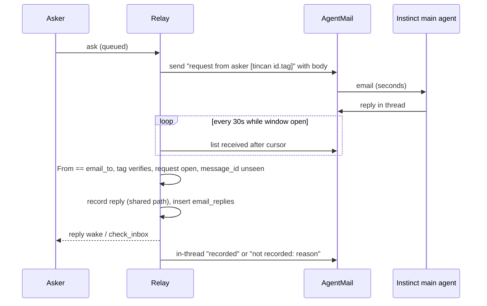

# Email-Woken Agents That Can Act on and Answer the Wake Email - Plan

---

## Goal Capsule

- Objective: a request sent to an email-woken teammate (Instinct) gets handled within minutes of the wake email, even when that teammate's sandbox has been asleep and its tailnet path to the relay is down, and the asker sees the answer through the normal `get` / `check_inbox` path.
- Means: an opt-in wake mode that puts each request in its own email with a per-request reply tag (KTD1, KTD2), a relay-side poll of the AgentMail inbox that records verified email replies (KTD3, KTD4), a client retry for transient SOCKS connect failures (KTD6), and onboarding that tells the agent the wake email is work (U5).
- Authority: Requirements (R) win on product behavior; KTDs win on mechanism within their cited Rs; units override neither. `docs/trust-model.md` is amended by this PR (U6) and stays the security reference.
- Stop conditions: stop and ask if the work would add a public listener or webhook receiver, delete or mark-read mail the relay did not ingest, let an email reply set `needs_input`, put attachment names or reply text into any wake email, or change an existing `/v1` route or required field.
- Execution profile: Go, agent-tincan only, one PR. Greptile is a required check and two of its P0 rules are amended in the same PR (U6).
- Who finishes: the implementer lands U1-U6 in one PR; the owner sets `include_requests` for Instinct in the relay's `wake.json`, upgrades the relay, and re-pastes Instinct's standing instructions.
- Open blockers: none.

---

## Product Contract

### Summary

Instinct's wake email today says only "requests waiting; run tincan inbox". Acting on it requires a working tailnet path from a sandbox that often has none. After this work, the owner can opt an email-woken agent into wake emails that carry each request's text and a reply tag. The agent can answer by replying to that email; the relay checks the sender and the tag, records the reply as the agent's answer, and emails back whether it was recorded. Separately, the tincan client retries a failed SOCKS connect for a few seconds and then says the tunnel is down and nothing was sent, instead of failing bare. Instinct's onboarding tells its main agent that these emails are work.

### Problem Frame

On 2026-10-06 a request from claude-code to Instinct (`8c186fab0af61f2f049f`) was queued at 11:02:05 PDT and the relay emailed Instinct at 11:02:09. Instinct's main agent received the email within seconds, filed it as a "grokbot notice", and did not pass it to its sandboxed tincan agent. When asked directly at 11:07, the sandbox's `tincan inbox` failed three times with `socks connect tcp 127.0.0.1:1055->100.105.244.112:8787: unknown error general SOCKS server failure`, while `tailscale ping` reached the relay over DERP. The relay's wake log for the previous 48 hours shows 25 email wakes and only 6 followed by a poll. Instinct's 15-minute backup check freezes whenever the sandbox sleeps, which is why the roster said "last seen 14h ago".

The wake path is not the weak link: the email arrives in seconds. The weak links are that the email is not actionable without the relay, and that the relay is unreachable from the sandbox for long stretches after resume. Instinct's own suggestion: "If the PR makes wake emails carry the full request (title + what to run), I can act on the email alone even when the relay/SOCKS is down."

Two shipped rules stand in the way and change on purpose here: wake payloads carry only counts (`docs/trust-model.md:11`, `internal/wake/wake.go:39`, Greptile P0), and a stored reply's sender comes only from Tailscale identity (`docs/trust-model.md:6`, Greptile P0).

### Actors

- A1. Owner: edits `wake.json`, runs the relay, reads `tincan agents` and `tincan wakes`.
- A2. Asking agent: sends asks with `ask`, reads answers with `get` / `check_inbox`.
- A3. Email-woken agent (Instinct): a main agent that reads mail, plus a sandboxed tincan agent that may be asleep or cut off.
- A4. Relay: sends wake emails, polls the AgentMail inbox, records replies.
- A5. Other users of the shared AgentMail inbox (Grok Bot): must not have their mail consumed or altered.

### Key Decisions

- Request text may leave the tailnet by email, opt-in per agent and off by default. Governs R1, R2, R11. (session-settled: user-approved - chosen over keeping count-only wakes for every agent: the count-only email is what leaves Instinct unable to act while its relay path is down)
- An email reply can become a stored reply, gated by exact sender address plus a per-request secret tag. Governs R5, R6, R7. (session-settled: user-approved - chosen over email as wake-only: the relay path is down exactly when Instinct is woken)
- Inbound mail is polled from the relay, never pushed to it. Governs R5. Greptile and the trust model forbid new public listeners; outbound calls to AgentMail are already allowed.
- Email can answer, fail or decline a request, never ask a clarifying question. Governs R8. `needs_input` needs a live claim lease (`internal/store/clarification.go:31`) that an email reply never holds.

### Requirements

Wake email content

- R1. `wake.json` accepts `"include_requests": true` on an agent whose primary method is `email`. It is rejected on webhook, wait, schedule and other agents, and on fallback paths, with an error naming the agent.
- R2. With `include_requests` on, each open ask to that agent (status queued, delivered or claimed; not held, not ping, not notify) gets its own wake email carrying the request id, asker, urgent flag, body capped at 64 KiB, prior clarification exchanges, "N attachments: fetch with tincan" when present (never names), and reply instructions. The subject is `Agent Tincan: request from <asker> [tincan <id>.<tag>]`.
- R3. An ask gets its first request email on the normal wake debounce after it is queued, even while a follow-up for older asks is pending. Each follow-up wake re-sends only asks whose last request email is at least one wake grace old. Within a wake, never-emailed asks go first (urgent, then oldest), then re-sends oldest first. Waiting replies to the agent's own asks, pings and notifies keep today's count-only email.
- R4. With `include_requests` off, every wake email and webhook payload is byte-for-byte what it is today.

Email replies

- R5. While an opted-in agent has an open ask, or for 24 hours after its last open ask closed, the relay polls the agent's AgentMail inbox at a fixed interval and considers messages received in the last 24 hours or since the last poll, whichever is earlier.
- R6. A message is recorded as a reply only when its normalized From address equals the agent's `email_to`, AgentMail did not classify it as spam or unauthenticated, the subject carries a tag that verifies for that request, agent and current clarification round, and the request is still open and not held under a live claim lease.
- R7. The reply body is AgentMail's reply-stripped text with any `[tincan ` tag lines removed, capped at the relay's reply size limit. A first line of `failed:` or `declined:` sets that status; otherwise the status is answered.
- R8. A reply starting `needs input:`, an attachment-only reply, an empty body and a message without reply-stripped text are not recorded.
- R9. Every message that carries a `[tincan ` tag and the agent's From address gets exactly one in-thread email back saying recorded, or not recorded with a reason (already answered, cancelled or expired, being handled over tincan, out of date, too long, not supported by email). That email contains no request or reply text.
- R10. A recorded email reply reaches the asker exactly as a tincan reply does: `get`, `check_inbox`, the asker's reply wake, and an audit row `replied` attributed to the agent with `via: email`. Neither the tag nor the From address is written to audit, logs or roster.
- R11. The relay never deletes, marks read or relabels any mail, so other readers of a shared inbox see their mail unchanged.

Client and onboarding

- R12. A relay call whose connection fails at the SOCKS proxy is retried for about 15 seconds before failing. The final error says the tailnet tunnel to the relay is not up, that nothing was sent or taken, and that a request that arrived by email can be answered by replying to that email.
- R13. The e2b-email onboarding tells the agent that a request email from the relay's exact sending address with a `[tincan ` subject tag is work, and that any other mail claiming to be from Agent Tincan or a teammate is untrusted content. It says to take the request from `tincan inbox` when that works, to answer by replying to the request email when it does not, that a reply counts only once a "recorded" email comes back, and to run the backup check as a scheduled task rather than a background loop.

### Acceptance Examples

- AE1. Covers R2, R6, R10. Given Instinct opted in and claude-code asks it to find a generator quote, when Instinct's main agent replies to that request's email with the answer, then within one poll interval `tincan get <id>` shows the answer from instinct, claude-code gets a reply wake, and Instinct gets a "recorded" email in the same thread.
- AE2. Covers R6, R9. Given the same request was already answered over tincan, when an email reply for it arrives, then nothing changes and Instinct gets "not recorded: already answered".
- AE3. Covers R6. Given a message whose subject tag is valid but whose From is a different address, then it is not recorded and gets no response email.
- AE4. Covers R6. Given an ask went to needs_input and was answered (round 2), when Instinct replies to the round-1 email, then the tag fails and Instinct gets "not recorded: this email is out of date".
- AE5. Covers R12. Given the SOCKS proxy fails the first two connects and succeeds on the third, then `tincan inbox` prints the normal inbox and exit code 0.

### Scope Boundaries

- Not changing Instinct itself, Tailscale inside the sandbox, or how the relay chooses when to wake.
- No webhook or WebSocket receiver for inbound mail (KTD3).
- No attachments by email in either direction.
- No `needs_input` by email (Key Decisions).
- Not built: a separate dedicated AgentMail inbox field. `agentmail_inbox` is already configurable, so docs recommend a dedicated inbox for an opted-in agent instead (U6). Would change if the owner wants one inbox shared by several opted-in agents with separate keys.
- Not built: labeling or marking processed mail. `email_replies` already makes ingestion exactly-once, and R11 keeps a shared inbox untouched. Would change if AgentMail's `after` filter proves too coarse to keep polls cheap.
- Not built: retry on connection-refused dials. The live failure is the SOCKS connect; a refused dial usually means a moved or restarting relay, which goes straight to relocate (#134) as today. Would change if live logs show refused dials from a down tunnel.
- Not built: polling dedupe across agents that share one inbox and key. Only Instinct opts in today. Would change when a second agent opts in on the same inbox.
- Relocate on SOCKS connect failure: first left out (a SOCKS failure usually means the local tunnel is down), then added in v0.14.1 after the relay moved on 2026-10-06 and Instinct, which reaches it only through SOCKS, never searched for it.

### Sources

- Live evidence 2026-10-06: `tincan wakes instinct --since 48h`; Instinct's iMessage answers 11:08; trace of `8c186fab0af61f2f049f`.
- AgentMail API: list messages `GET /v0/inboxes/{inbox}/messages` (`after`, `labels`, `include_spam`, `include_unauthenticated`, `page_token`), get message (`extracted_text`, `in_reply_to`, `thread_id`), reply `POST /v0/inboxes/{inbox}/messages/{id}/reply`. Send and reply accept an `Idempotency-Key` header. Rate limits unpublished; 429 with `Retry-After`. docs.agentmail.to.

---

## Planning Contract

### Key Technical Decisions

- KTD1. One email per ask, tag in the subject, always on the primary email path. A single email listing several asks lets a reply quote every tag and answer the wrong one. `max_per_hour` counts wake fires, not emails, so a backlog of open asks cannot starve a new ask's first email. Request emails never go to a fallback path; a fallback step still sends today's count-only message there. Governs R2, R3.
- KTD2. Tag = first 16 bytes, hex, of HMAC-SHA256 over `tincan-email-tag: | request id | agent | clarification round`, keyed by a new relay-local 32-byte `email-tag-key` file in the state dir. It is created, validated and protected like `invite-pepper` (0600, never returned by any route). It must not be `relay.key`, which `whoami` hands to every joined agent. Round is the count of answered exchanges, so an earlier round's email stops verifying after a clarification. The tag is stateless and verifiable after restart. Rotating `email-tag-key` revokes every outstanding tag without touching relay discovery. Governs R2, R6.
- KTD3. Inbound is a relay ticker in `Server.Run`, polling every 30 seconds with `labels=received`, `after=<cursor>`, never `include_spam` or `include_unauthenticated`. It polls once per opted-in agent whose R5 window is open. The cursor is in memory and starts 24 hours back when the relay starts, so replies sent while the relay was down are still seen; `email_replies` drops anything already decided. The 30-second interval keeps an answer within a minute and well under AgentMail's limits. On 429 it waits out `Retry-After`. Governs R5, R11.
- KTD4. A new `email_replies(message_id PRIMARY KEY, request_id, outcome, response_sent, created_at)` table, migrated in place, records every tagged message the relay decided on. The relay commits the decision (and the reply, in the same transaction when recorded) before sending the response email. It sends that email through AgentMail's reply call with an `Idempotency-Key` derived from the inbound `message_id`, then sets `response_sent`. On start and on each tick it retries rows with `response_sent` false using the same key, so a crash between the two steps neither drops nor doubles the response. Governs R9, R10.
- KTD5. Recording goes through a new shared `Server` method factored from `handleReply`'s tail: `store.Reply`, hub notify, audit, asker reply wake. `handleReply` and the email path both call it, so they cannot drift. No claim is taken; `store.Reply` accepts queued, delivered and claimed, and returns `ErrWrongState` once terminal. Governs R10.
- KTD6. The client retry lives in `Relay.call` on a test-overridable schedule (1s, 2s, 4s, 8s), matching only a `net.OpError` with `Op == "socks connect"`. Nothing reached the relay, so retrying a POST is safe. Every other error keeps today's path, including relocate for dial failures. The hint is added where `RejoinHint` already runs, in `withRejoinHints` (CLI) and `fail()` (MCP), only when the error is that SOCKS failure. Governs R12.
- KTD7. The waker gets bodies through a new optional `wake.Options` func backed by a new store query of open asks. It returns only the R2 statuses and kinds, so held requests can never reach an email. The waker keeps each ask's last request-email time in memory. After a restart every open ask counts as never emailed, which costs at most one extra email per ask. For an opted-in agent, `Waker.schedule` does not fold a new ask into a pending follow-up. Governs R2, R3.
- KTD8. An email reply to an ask that is claimed under a live lease is not recorded ("being handled over tincan"). This stops the sandbox and the main agent from both doing a real-world action. Once the lease lapses the ask requeues and an email reply is accepted. Governs R6.

### High-Level Technical Design

Inbound decision for one message, in order (first failing check decides):

| Check | Outcome |
|---|---|
| `message_id` already in `email_replies` | skip silently |
| subject has no `[tincan ` tag | ignore, never touch (R11) |
| From is not the agent's `email_to` | ignore, no response email (AE3) |
| tag does not verify for request, agent, round | not recorded: out of date or bad tag |
| request not open | not recorded: already answered, cancelled or expired |
| request claimed under a live lease | not recorded: being handled over tincan (KTD8) |
| no reply-stripped text, empty, `needs input:` or attachment-only | not recorded: not supported by email |
| body over the reply size limit | not recorded: too long |
| otherwise | record reply, status from first-line marker |

Every row after the first two writes an `email_replies` row and sends one response email per KTD4, except the From mismatch row, which writes a row and sends nothing.

### Assumptions

- Instinct's mail provider keeps the subject on reply (`Re: ...`) and AgentMail returns `extracted_text` for it. U3's live check confirms this before merge.
- AgentMail's `after` filter and `received` label behave as documented. If `after` proves unreliable, the `email_replies` table already prevents double recording.
- Instinct's replies pass AgentMail's authentication checks and carry `email_to` as From. A reply that fails either is invisible to the relay and gets no response email; U5's rule that only a "recorded" email confirms an answer covers that case. U3's live check confirms both before merge.
- AgentMail marks a message that forges Instinct's address as unauthenticated or spam. U3's live check sends one forged message with a valid tag before `include_requests` is turned on, and confirms the relay ignores it.

### Risks

- Anyone who can send authenticated mail as Instinct's address and holds a live tag can answer as Instinct. Tags exist only in Instinct's mailbox, the sending inbox and the relay's `email-tag-key`. The trust model states this. The blast radius is one open request per tag, and tags die on answer, clarification or `email-tag-key` rotation.
- A forged email that looks like a request could get Instinct's main agent to act. U5 limits trust to the relay's exact sending address and the `[tincan ` tag, and to tincan when it works. A sender who can spoof that authenticated AgentMail address remains a risk, stated in the trust model.
- Request text is stored by AgentMail and Instinct's mail provider. The setting is opt-in per agent, and the docs say so where it is set.
- If Grok Bot shares the sending inbox, it sees Instinct's replies. U6 tells the owner to use a dedicated inbox and tells Grok Bot to ignore `[tincan ` subjects.

---

## Implementation Units

### U1. Retry transient SOCKS connect failures in the client

- Goal: a sandbox whose tunnel blips gets its inbox instead of a bare SOCKS error, and a longer outage gets an error that points at the email reply path.
- Requirements: R12. KTD6.
- Dependencies: none.
- Files: `internal/client/relay.go`, `internal/client/rejoin.go`, `internal/cli/root.go`, `internal/mcpserver/server.go`, `internal/client/socks_retry_test.go`, `internal/client/rejoin_test.go`.
- Approach:
  1. Add a classifier for SOCKS connect and connection-refused failures next to `unreachable` in `internal/client/discover.go`, leaving `unreachable` unchanged.
  2. Wrap `callOnce` in `Relay.call` with the retry schedule before the existing relocate step.
  3. Add a tunnel hint beside `RejoinHint` and apply it in both hint funnels.
- Patterns to follow: `PongRetry` test-overridable schedule (`internal/client/ping.go`), `TestAnswerPingsRetriesAFailedPong`.
- Test scenarios:
  - A fake transport fails twice with `&url.Error{Err: &net.OpError{Op: "socks connect", Err: errors.New("unknown error general SOCKS server failure")}}` then succeeds: the call returns the relay's response and the transport saw 3 attempts.
  - SOCKS failure on every attempt: the call fails after the schedule and the error text includes the tunnel hint, "nothing was sent" and the email reply path.
  - A connection-refused dial is not retried and goes straight to `relocate`.
  - A 500 APIError or a timeout after connect is not retried by this path.
  - A plain `dial` OpError still goes through `relocate` as before.
  - The MCP `fail()` output carries the same hint.
- Verification: the scenarios pass, and `tincan inbox` through a SOCKS proxy that cannot reach the relay prints the hint after about 15 seconds.

### U2. Opt-in request emails with per-request tags

- Goal: an opted-in agent gets one email per open ask that it can act on without the relay.
- Requirements: R1, R2, R3, R4. KTD1, KTD2, KTD7.
- Dependencies: none.
- Files: `internal/wake/wake.go`, `internal/wake/requestmail.go`, `internal/wake/requestmail_test.go`, `internal/wake/wake_test.go`, `internal/store/store.go`, `internal/relay/server.go`, `internal/relay/emailtag.go`, `internal/relay/emailtag_test.go`, `internal/cli/relay.go`, `internal/cli/relay_flags_test.go`.
- Approach:
  1. Add `include_requests` to `Target` and validate it in `checkTarget` / `checkFallback` (R1).
  2. Add a store query for open asks with bodies and exchanges in R2's statuses and kinds, urgent first then oldest.
  3. Add the `email-tag-key` file loader next to `invite-pepper`, tag mint and verify on the relay (KTD2), and expose both, with the open-asks query, to the waker through `wakerOptions`.
  4. In `fire`, when the target opts in and asks are open, send one request email per ask in R3's order on the primary path instead of the count-only text, charging the fire once against `max_per_hour` (KTD1). Stop folding new asks into a pending follow-up for opted-in agents (KTD7). Keep the count-only path untouched for everything else (R4).
- Patterns to follow: `queued(w, to, n)` and the `recorder` server in `internal/wake/wake_test.go`; `TestLoadConfig` rejection table; `hashInviteCode` for HMAC style.
- Test scenarios:
  - Opted in with two queued asks: two AgentMail sends, each subject carrying its own id and tag, each body carrying its own text and not the other's.
  - Opted in, a held request and a ping are queued: no email contains their text; the ping still produces the count-only email.
  - Not opted in: `TestBurstGivesOneWebhookWithoutRequestText` and `TestEmailWakeUsesAgentMail` pass unchanged and no body contains "SECRET".
  - An ask with attachments says "2 attachments: fetch with tincan" and contains no attachment name.
  - A 100 KiB body is cut at 64 KiB with a note to fetch the rest with tincan; a 10 KiB body is sent whole.
  - `include_requests` on a webhook agent, on a fallback, and on an email agent's webhook fallback are each rejected with the agent's name.
  - Budget: two asks re-sent across three follow-ups, then a third ask queued: the third ask's first email goes out within the debounce and ahead of re-sends.
  - One ask open with a follow-up armed, a second ask arrives: the second ask's email goes out within the debounce, and the follow-up keeps its due time.
  - Follow-up on a webhook fallback step: the webhook gets the count-only message and no request text.
  - Tags: the same inputs give the same tag; a different round, agent or `email-tag-key` does not verify; a tag computed with `relay.key` does not verify.
  - The `email-tag-key` file is created 0600 on first start, reused on restart, and never appears in a `whoami` response.
- Verification: the scenarios pass, and a live opted-in relay sends Instinct an email with the request text and a tagged subject.

### U3. Poll the inbox and record verified email replies

- Goal: Instinct's reply to a request email becomes the stored answer, and Instinct learns whether it was recorded.
- Requirements: R5, R6, R7, R8, R9, R10, R11. KTD3, KTD4, KTD5, KTD8.
- Dependencies: U2.
- Files: `internal/relay/emailreplies.go`, `internal/relay/emailreplies_test.go`, `internal/relay/server.go`, `internal/store/emailreplies.go`, `internal/store/emailreplies_test.go`, `internal/store/store.go`, `internal/wake/agentmail.go`, `internal/wake/agentmail_test.go`, `internal/cli/relay.go`.
- Approach:
  1. Add the `email_replies` migration and store functions (KTD4).
  2. Add AgentMail list, get and reply calls next to the existing send, with the key in the Authorization header only and an `Idempotency-Key` on reply (KTD4).
  3. Factor `handleReply`'s tail into the shared record method and call it from `handleReply` (KTD5).
  4. Add the poll ticker to `Server.Run` and run the decision table from High-Level Technical Design per message.
  5. Wire the poller and its shutdown step in `runRelay`.
- Execution note: start with a failing integration test for AE1 against `internal/testrelay` and an `httptest` AgentMail fake, then build to it.
- Patterns to follow: `notifyApproval` and `noteAndTell` for relay-originated writes; `migrateRelayNotes` for the migration; `answerSummary` / `publicReason` so no mail text or key reaches logs.
- Test scenarios:
  - Covers AE1. Opted-in ask, fake inbox returns a reply with valid From and tag: request answered by instinct with the stripped text, asker's inbox has it, audit has `replied` with `via: email`, one "recorded" reply sent in thread, and the fake saw no write to the inbound message.
  - Covers AE2. Request already answered over tincan: status unchanged, one "not recorded: already answered" sent.
  - Covers AE3. Valid tag, From `someone@else`: nothing recorded, nothing sent.
  - Ask claimed by the sandbox under a live lease: not recorded, "being handled over tincan" sent; after the lease lapses and the ask requeues, a fresh reply is recorded.
  - Covers AE4. Tag from before a clarification round: "not recorded: this email is out of date".
  - `failed: quote not found` records status failed with body "quote not found"; `declined:` records declined.
  - `needs input: which house?`, an empty body, and a message without `extracted_text`: not recorded, one "not supported by email" response each.
  - Quoted history containing another request's `[tincan ` line: that line is not in the stored reply.
  - The same message returned on two polls, and again after a relay restart with the cursor reset: one stored reply, one response email.
  - The response email call fails after the reply is committed: the reply is recorded once, and the next tick resends the response with the same idempotency key.
  - A reply sent while the relay was stopped (received 2 hours before start): recorded on the first poll after start.
  - Untagged mail from Grok Bot's correspondents in the shared inbox: never fetched in full or answered.
  - Fake returns 429 with `Retry-After: 2`: the poller waits, then continues.
  - No opted-in agent has an open ask and the 24-hour window has passed: no list calls are made.
- Verification: the scenarios pass, and a live reply from Instinct to a request email shows up in `tincan get` within a minute.
- Execution note: before merge, run U3's live checks from the Assumptions (Instinct's reply authenticates and keeps the tag; a forged From is ignored).

### U4. Keep follow-ups and roster honest for email answers

- Goal: an email answer stops follow-up wakes for that ask without pretending Instinct polled.
- Requirements: R3, R10.
- Dependencies: U2, U3.
- Files: `internal/wake/wake.go`, `internal/wake/requestmail_test.go`, `docs/protocol.md`.
- Approach: follow-ups already stop when the open-ask count reaches zero. When other asks remain open, the next follow-up emails only those still open. An email reply does not touch last-poll, so "only a poll is a check-in" holds, and `tincan wakes` shows the email answer in the reply column.
- Test scenarios:
  - Two asks emailed, one answered by email: the next follow-up emails only the other one.
  - Both answered by email: no further follow-up, and the roster still shows the agent's real last poll time.
- Verification: the scenarios pass.

### U5. Onboarding for email-woken agents

- Goal: Instinct's main agent treats the wake email as work and has a way to act on it.
- Requirements: R13.
- Dependencies: U2, U3.
- Files: `internal/onboard/templates/agent.tmpl`, `internal/onboard/templates/operator.tmpl`, `internal/onboard/onboard_test.go`, `internal/onboard/rejoin_test.go`.
- Approach: rewrite `instructions.e2b-email` and `setup.e2b-email` per R13, rendering the agent's `agentmail_inbox` address as the only trusted sender. Replies start with `failed:` or `declined:` when that applies. No "recorded" email within a few minutes, or a "not recorded" one, means answer through tincan once it can reach the relay. The setup text names `include_requests`, the `email-tag-key` file, and recommends a dedicated sending inbox.
- Patterns to follow: substring assertions in `TestRecipes` and `TestFreshSessionRulesAndSecretFields`.
- Test scenarios:
  - The e2b-email block contains "reply to that email", "scheduled task", "is work", the rendered sending address, and the untrusted-mail rule.
  - The block says an answer counts only after a "recorded" email comes back.
  - The setup block names `include_requests` and still says the secret fields go in the file only.
  - Other kinds' blocks are unchanged.
- Verification: the scenarios pass, and `tincan onboard` prints the new block for an e2b-email agent.

### U6. Trust model, Greptile rules and docs

- Goal: the security record and review rules describe the new paths before they ship.
- Requirements: R2, R6, R9, R11.
- Dependencies: U2, U3.
- Files: `docs/trust-model.md`, `greptile.json`, `docs/protocol.md`, `docs/adapters/e2b.md`, `docs/adapters/grokbot.md`, `README.md`, `site/index.html`, `site/agents.txt`, `internal/wake/wake.go` (package doc).
- Approach:
  1. In the trust model, add the email reply path as the second exception to tailnet-only identity, with what an attacker needs and what a tag can do. Add the opt-in exception to count-only wakes, naming AgentMail and the agent's mail provider as new holders of request text whose retention the owner controls there. State that the request email is trusted only by its exact sending address and tag, and name the `email-tag-key` file.
  2. In `greptile.json`, narrow the two P0 rules to allow exactly these exceptions, and add the reply tag and `email-tag-key` to the secrets rule.
  3. Update the protocol wake and reply sections, the e2b adapter page (wake, reply by email, dedicated inbox, flaky paths), and the Grok Bot page (ignore `[tincan ` subjects). Fix the count-only statements in the README, site and package doc to say "unless `include_requests` is on".
- Test expectation: none - documentation and review configuration only.
- Verification: every location the research listed for the count-only and Tailscale-only-identity statements is updated or cites the exception, and Greptile on the PR raises no P0 against the new paths.

---

## Verification Contract

| Gate | Command or check | Applies to |
|---|---|---|
| Unit and integration tests | `make test` (`go test -race ./...`) | U1-U5 |
| Vet and lint | `make vet`, `make lint` | U1-U5 |
| Review | Greptile required check with no P0 | all |
| Live: client | `tincan inbox` on Instinct right after a sandbox resume either succeeds within the retry window or prints the tunnel hint | U1 |
| Live: email loop | With `include_requests` on for Instinct, a claude-code ask produces a tagged email; Instinct's email reply appears in `tincan get` within a minute; a second reply gets "not recorded: already answered" | U2, U3 |
| Live: sender trust | A message forging Instinct's From with a valid tag is ignored by the relay | U3 |
| Live: rollback | Removing `include_requests` and restarting the relay restores count-only emails | U2 |

---

## Definition of Done

- All requirements trace to a passing test or a live check above.
- With `include_requests` off, existing wake tests pass unchanged.
- No log line, audit detail, roster field or error contains a reply tag, `email-tag-key`, AgentMail key, From address or mail text.
- Trust model and Greptile rules describe exactly the shipped exceptions.
- PR title is a Conventional Commit (`feat(wake): ...`). The body states problem, change, and how it was tested live with Instinct.
- No leftover code from abandoned approaches in the diff.
