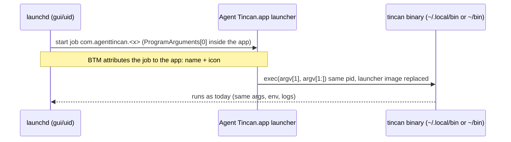
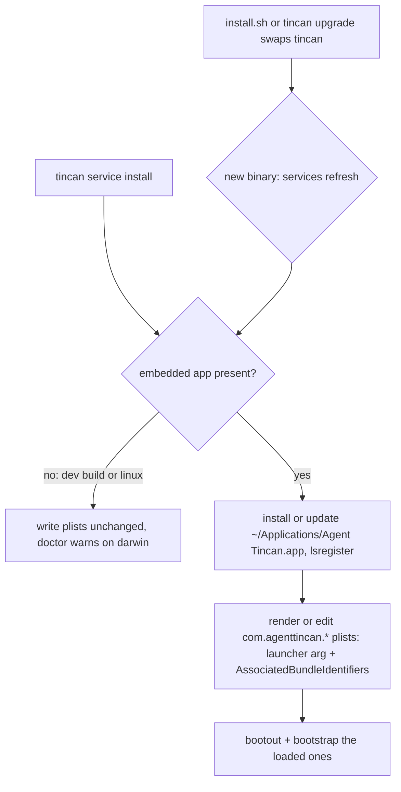

# macOS Login Items show Agent Tincan - Plan

## Goal Capsule

- Objective: On a Mac, every tincan background service appears in System Settings > Login Items, and in the "App Background Activity" notification, as "Agent Tincan" with the tincan icon instead of the maintainer's personal name, on new installs and on Macs that already run tincan.
- Means: services start through a small signed launcher inside "Agent Tincan.app", which then runs the unchanged `tincan` binary (KTD1). The app ships inside the macOS `tincan` binary (KTD2).
- Authority: Requirements (R) win on product behavior. KTDs win on mechanism within the Rs. Units override neither.
- Stop conditions: stop and report before any release in any of these cases:
  - The live check in U7 still shows "Matthew Charles Van Horn" on either test Mac for any refreshed service other than notes (R1's exception).
  - A wrapped service loses protected-folder access it has today, or needs a grant to "Agent Tincan" to keep working (U7 step 5).
  - U7 shows a code other than signed tincan running through the launcher with a privacy grant.
  - Every app update re-notifies the user for every job.
- Execution profile: Go code plus Makefile packaging and Apple signing. Signing, notarizing and the live checks run locally on the maintainer's Mac (Developer ID and the `AgentNotesNotary` notary profile live there). CI has no signing identity.
- Who finishes: the implementer lands U1 to U6 in one PR. U7 runs on two real Macs before the release that ships it.

---

## Product Contract

### Summary

Ship a minimal, signed and notarized "Agent Tincan.app" that tincan installs into `~/Applications` by itself. Point every tincan LaunchAgent at a tiny launcher inside that app, and tag each LaunchAgent with the app's bundle identifier. `tincan services refresh` rewrites services that already exist, and `tincan upgrade` runs it automatically from now on.

### Problem Frame

Since macOS 13, Background Task Management lists every launchd job in Login Items and notifies the user when one is added. A job whose program is a bare command-line binary has no app name or icon, so macOS falls back to the name on its code signature. tincan is signed "Developer ID Application: Matthew Charles Van Horn (NM8VT393AR)". So every new user sees "Software from 'Matthew Charles Van Horn' can run in the background", with a blank icon, the moment any tincan service starts. Right after launch, a person's name in that popup reads like spyware and costs trust. A new user hit exactly this on 2026-10-08.

### Requirements

Visible name

- R1. Every macOS LaunchAgent whose label starts with `com.agenttincan.` shows as "Agent Tincan" with the tincan icon in Login Items and in the background-activity notification. The notes service is the one exception until KTD7's evidence allows it.
- R2. A fresh install gets R1 with no admin password and no step beyond the existing install and `tincan <service> install` flow.

Existing installs

- R3. A Mac that already runs tincan services gets R1 after `tincan services refresh`, including `com.agenttincan.*` plists tincan did not write itself, such as hand-written `codex-listen` and `web.dots`.
- R4. From this release on, `tincan upgrade` keeps the installed app and the service files current without a separate step.

No regressions

- R5. Services keep their labels, arguments, environment, logs, the `tincan` binary path, and the privacy access they have today, such as codex-listen's Documents folder. No working service needs a new grant to "Agent Tincan". Upgrades keep replacing that binary in place, and Linux and systemd output is byte-identical to today.
- R6. The notes service's Files and Folders access stays scoped as tightly as today: no other tincan service and no child process gains it. If macOS needs it re-granted, `tincan notes doctor` names exactly the code that U7 showed macOS checks, never a guess.
- R7. When R1 cannot take effect, `tincan doctor` says so and gives the fix. Examples: a development build without the embedded app, a service file not yet refreshed, a missing or modified app, or a stale macOS record.
- R8. `tincan services refresh --revert` puts every service back to running `tincan` directly, for rollback and uninstall.

Trust

- R9. The "Agent Tincan" name and icon only ever cover the release-signed `tincan`. The launcher refuses any other program, so other software cannot borrow the name.

### Scope Boundaries

- Linux and systemd services, the relay's behavior, and the Chrome native-messaging host are unchanged.
- No change to the signing certificate or the Apple developer account name.
- Not built: hostile-entry checks when unpacking the app zip. The zip is build-time content inside the signed binary, and the signature check before the swap catches a malformed or tampered bundle.
- Not built: automatic `sfltool resetbtm`. It wipes every Login Item approval the user has, for all apps. U5 documents it as a manual last resort, and nothing runs it. Evidence that a targeted reset exists would change this.
- Known gap: the notes service keeps showing the signer's name until KTD7's evidence allows wrapping it.
- Not built: moving `tincan` itself into the app bundle. It would change the path upgrades replace and the identity privacy grants are tied to (KTD1). It returns only if U7 shows the launcher approach fails.

### Deferred to Follow-Up Work

- A designed 1024px app icon. This plan ships an interim icon derived from the current site artwork (KTD6).

---

## Planning Contract

### Key Technical Decisions

- KTD1. Services launch through a launcher inside the app. `ProgramArguments` becomes `[<app>/Contents/MacOS/agent-tincan, <tincan binary>, <original args...>]`. The launcher replaces itself with the tincan binary through exec, so the running process is the same signed `tincan` as today. The plist also carries `AssociatedBundleIdentifiers` = `com.agenttincan.app`.
  - Why: research found that the bundle-ID key alone has a mixed record. It has shown the icon without the name, and kept old names on machines that had already registered the job. Jobs whose first program argument is inside an `.app` get the app's name.
  - Keeping `tincan` where it is (session-settled: user-approved - chosen over moving the binary into the app bundle: that would change the path upgrades swap and the code identity behind privacy grants).
  - Rejected: `BundleProgram` and SMAppService. Both only work for plists shipped inside the app bundle (man launchd.plist), so they force the binary into the bundle and cannot keep hand-written plists (R3, R5).
  - The launcher execs only a target whose code signature satisfies an Apple-anchored Developer ID requirement, checked after resolving symlinks (R9). Matching the Team ID string alone is not enough, because a self-signed certificate can set the same OU. The requirement is `anchor apple generic and certificate 1[field.1.2.840.113635.100.6.2.6] exists and certificate leaf[field.1.2.840.113635.100.6.1.13] exists and certificate leaf[subject.OU] = "NM8VT393AR"` plus a tincan identifier: `tincan_darwin_*`, and `com.agenttincan.tincan` once `sign-mac` sets it. KTD3 reuses the same requirement, with identifier `com.agenttincan.app`, for the installed app. A same-user attacker can still swap the file between the check and the exec, or point the launcher at real tincan with hostile args. That matches today's exposure, since a plist can already name signed tincan, and `docs/trust-model.md` says so.
- KTD2. The signed, notarized and stapled app is embedded in the darwin `tincan` binary as a zip. `tincan upgrade` only fetches `tincan_<os>_<arch>` names through the relay's dist allowlist (`internal/relay/dist.go`). A separate release asset would never reach existing Macs without widening that allowlist, the relay manifest and `relay-upgrade --from-github`. The embedded zip is a few MB and has no circular dependency, because the launcher is a separate program built before tincan.
- KTD3. The app is identified as `com.agenttincan.app`, named "Agent Tincan", installed at `~/Applications/Agent Tincan.app`, and marked `LSUIElement` so it never shows a Dock icon. A per-user location needs no admin password (R2).
  - Handlers: `Info.plist` declares no URL schemes, document types or services, so registering it never makes tincan a handler for anything.
  - When the app is replaced: only when the installed copy is missing, fails signature validation (Team ID plus `com.agenttincan.app`), or differs from the embedded zip's content hash. The version string isn't the trigger, so routine upgrades don't touch an unchanged app and don't re-trigger macOS notifications (U7 confirms this).
  - Extraction: a fresh temp directory next to the destination. The temp copy's signature is validated, then swapped with the installed app in one step through `unix.RenamexNp` with `RENAME_SWAP` (golang.org/x/sys is already a dependency), so the launcher path is never missing. The old copy, now at the temp path, is removed. A plain rename is used only when no app is installed yet. Then `lsregister -f` runs at the app's absolute path.
- KTD4. Template rendering stays in the shared writer. `history.installServiceDef` is the only path all five tincan-written services use. On darwin, when the app is installed, it fills two new placeholders: a launcher argument before the binary, and an `AssociatedBundleIdentifiers` block placed away from `ProgramArguments`, since the council test pins the arguments' adjacency. Otherwise both placeholders render empty, so dev and Linux output does not change.
- KTD5. Existing plists are edited in place with `/usr/bin/plutil`, never re-rendered from templates. This preserves keys tincan did not write, such as `--name dot-web`, custom logs and sorted keys. A plist is changed only when its first program argument is a tincan binary or an existing launcher. Anything else is reported and skipped. Loaded services are restarted with `launchctl bootout` then `bootstrap`, since launchd only reads a plist at bootstrap.
  - Which plists are tincan's: only a regular file (not a symlink) whose `Label` equals its file stem and starts with `com.agenttincan.`, that has no `BundleProgram` key, and whose program, after resolving symlinks, is the running binary's resolved path. The program is `Program` when that key is set, otherwise `ProgramArguments[0]`. A `Program`-based plist is wrapped by moving that path into `ProgramArguments` after the launcher and removing `Program` or a launcher at a known app path followed by that binary. Everything else is reported and skipped.
  - Edits are atomic: modify a temp copy with `/usr/bin/plutil`, check it with `plutil -lint`, then rename it over the original.
  - Restarts: only jobs that were already loaded. Wait until `/bin/launchctl print` no longer finds the job, then bootstrap, retrying a bounded number of times. On final failure, restore the original plist, reload it, and report loudly.
  - Never restart the job refresh runs under. It is found from `XPC_SERVICE_NAME`, falling back to process ancestry. A codex run under `codex-listen` that runs `tincan upgrade` shares that job's process group, so bootout would kill refresh halfway through and leave the job unloaded. That plist is rewritten and reported as "takes effect at next restart".
  - Upgrade: `tincan upgrade` runs the new binary's `services refresh` after the swap. The running services otherwise keep executing the old build until restarted anyway.
  - First release: the binary doing the upgrade is the old one, which knows nothing of refresh. So that release's notes and onboarding tell users to run `tincan services refresh` once.
- KTD6. Interim icon: `site/icon-192.png` scaled into an `.icns` with `sips` and `iconutil` at build time. The repo has no larger square art. A real 1024px icon replaces the source file later with no code change.

### High-Level Technical Design

How a service starts after the change:

How an install reaches the app and the service files:

- KTD7. Privacy attribution for notes is decided by evidence, with a safe default.
  - Quinn's guidance is that `AssociatedBundleIdentifiers`, and possibly an app-embedded program, makes the app the "responsible code" for privacy checks. A grant to "Agent Tincan" would then cover every job attributed to the app, including `codex-listen`'s model-driven commands. That breaks the scoping `internal/cli/notes.go` deliberately keeps.
  - Default: the notes plist is never wrapped and never tagged, and it keeps today's attribution.
  - U7 measures whether the launcher alone moves responsibility. Notes joins the launcher only if a grant to the app provably cannot reach other jobs, which is otherwise deferred.

### Assumptions

- Login Items attribution comes from the plist, its first program argument and the bundle-ID key, not from the running process. So exec does not undo R1.
- `/usr/bin/plutil`, `lsregister`, `sips` and `iconutil` exist on every supported macOS. They ship with the OS.

---

## Implementation Units

### U1. Launcher and app bundle build

- Goal: produce a signed, notarized, stapled "Agent Tincan.app" zip ready to embed.
- Requirements: R1, R2, R9.
- Dependencies: none.
- Files:
  - `cmd/agent-tincan-app/main.go`, `cmd/agent-tincan-app/main_test.go`
  - `internal/macapp/Info.plist.tmpl`
  - `Makefile`
- Approach:
  1. The launcher execs `argv[1]` with `argv[1:]`.
     - It refuses, exiting non-zero with a one-line stderr message, when `argv[1]` is missing, not absolute, not executable, or fails KTD1's signature requirement.
     - The signature check uses the Security framework, or `/usr/bin/codesign --verify -R`, behind an injectable verifier.
     - Launched with no arguments, as from Finder, it exits 0 and does nothing.
  2. A new `mac-app` make target builds the launcher for arm64 and amd64 and joins them with `lipo`. It assembles the bundle with `Info.plist` (KTD3 identifiers, `CFBundleVersion` = `VERSION`, `LSUIElement`) and an `.icns` built per KTD6.
  3. Signing goes inner executable first, then the bundle, with the hardened runtime and no `--deep`. The target then notarizes a `ditto` zip, staples the app, and re-zips the stapled app to `internal/macapp/embedded/AgentTincan.zip`, which is gitignored.
- Patterns to follow: the `sign-mac` and `notarize-mac` recipes and their identity and profile variables in `Makefile`.
- Test scenarios:
  - Launcher with `[/abs/fake-tincan, a, b]` runs the fake with exactly `a b` and the same pid. Use a helper binary that prints its pid and args.
  - Launcher with a relative path, a missing file, or a non-executable file exits non-zero and names the problem.
  - A verifier rejecting an ad-hoc-signed target, or one signed by another identity, stops the exec with a signature message.
  - The production verifier's requirement string contains the Apple anchor and both Developer ID certificate fields.
  - A verifier accepting a release-signed tincan proceeds. U7 checks this with real signatures.
  - A symlinked target is verified at its resolved path.
  - Launcher with no arguments exits 0 without running anything.
- Verification: `codesign --verify --strict --deep` passes on the built app, `spctl -a -t exec -vv` reports Notarized Developer ID, and `stapler validate` succeeds.

### U2. Embed and install the app

- Goal: `tincan` can install or update `~/Applications/Agent Tincan.app` from its embedded zip.
- Requirements: R2, R4, R7.
- Dependencies: U1.
- Files:
  - `internal/macapp/macapp.go`
  - `internal/macapp/embed_macapp.go` (build tag `macapp`)
  - `internal/macapp/embed_none.go` (no tag)
  - `internal/macapp/macapp_test.go`
- Approach:
  1. `Embedded()` reports whether the zip is present.
  2. `Ensure(home)` installs or updates the app per KTD3 and returns the launcher path. Every command that installs, refreshes or checks services calls it, so a trashed app comes back on the next one.
  3. On non-darwin, or with no embedded zip, `Ensure` returns a typed "unavailable" result and no error.
- Patterns to follow: temp-next-to-target staging as in `writeFileAtomic` in `internal/history/native.go`, with the directory swap from KTD3. Signature validation goes through an injectable validator like U1's verifier, because CI has no signing identity.
- Test scenarios:
  - Fresh home, with the test zip injected through a package variable: the app appears at the KTD3 path with the launcher executable and correct identifier, and the returned path is that launcher.
  - Identical, validly signed app already installed: nothing is rewritten. Assert the mtime is unchanged.
  - Different content hash installed: it is replaced, and no temp directory is left behind.
  - Same version but a modified launcher, so signature validation fails: it is replaced.
  - Corrupt zip, or wrong identifier: an error is returned, and any existing app is left intact.
  - No embedded zip: an unavailable result, and nothing written.
- Verification: the tests above pass on macOS CI. A locally built `-tags macapp` binary installs a launchable app.

### U3. New service files use the launcher

- Goal: every tincan-written LaunchAgent renders with the launcher and the bundle identifier when the app is available.
- Requirements: R1, R2, R5.
- Dependencies: U2.
- Files:
  - `internal/history/service.go`, `internal/history/service_test.go`
  - `examples/history/com.agenttincan.history.plist`
  - `internal/council/service.go`, `internal/council/service_test.go`
  - `internal/notes/service.go`, `internal/notes/service_test.go`
  - `internal/watch/watch.go`, `internal/watch/watch_test.go`
  - `internal/cli/web_test.go`
- Approach:
  1. Add the two KTD4 placeholders to each launchd template, and update the test-locked example plist.
  2. Make `installServiceDef` call `macapp.Ensure` on darwin, and fill the placeholders only when it returns a launcher path. The notes service never gets them (KTD7). A `ServiceOptions` field lets tests inject a launcher path without a real app.
  3. Leave systemd templates untouched.
- Patterns to follow: the `__PLACEHOLDER__` and `strings.NewReplacer` rendering with `xmlEscape`, and the hostile-path test binaries already used.
- Test scenarios:
  - Darwin with an injected launcher at a path containing `&` and `'`: `ProgramArguments` starts with the escaped launcher, then the tincan binary and the original args. `AssociatedBundleIdentifiers` holds `com.agenttincan.app`, and no `__` remains.
  - Darwin with the app unavailable: the output is byte-identical to the template rendered without the placeholders, as today.
  - Linux: unit file output is byte-identical to before for all five services.
  - Council: the existing `binary|council|serve|EnvironmentVariables` adjacency assertion still holds with the launcher present, adjusted only to start with the launcher.
  - Web `dots` with `--thread`: the thread args still follow the binary in order.
  - Notes on darwin with a launcher available: rendered exactly as today, with no launcher and no bundle key.
- Verification: `go test ./internal/history/... ./internal/council/... ./internal/notes/... ./internal/watch/... ./internal/cli/...` passes, and the example plist equals the template.

### U4. Refresh existing services and wire upgrade

- Goal: existing Macs move to the launcher with one command, and upgrades keep them current.
- Requirements: R3, R4, R5, R6, R8.
- Dependencies: U2, U3.
- Files:
  - `internal/cli/services.go`, `internal/cli/services_test.go`
  - `internal/cli/upgrade.go`, `internal/cli/upgrade_test.go`
- Approach:
  1. `tincan services refresh` runs `macapp.Ensure`, then applies KTD5 to each `~/Library/LaunchAgents/com.agenttincan.*.plist`. It inserts or replaces the launcher at index 0, adds `com.agenttincan.app` to `AssociatedBundleIdentifiers` (creating the key, or appending to an existing array), and skips notes (KTD7). `--revert` removes only that entry, and drops the key only if refresh created it.
  2. The command prints one line per plist: updated, already current, skipped (with the reason), restarted, or "takes effect at next restart" for its own job. `--revert` strips the launcher and the key (R8).
  3. The command is a no-op with a clear message on Linux or when the app is unavailable.
  4. After a successful swap, `upgrade` execs the new binary with `services refresh` on darwin and prints its output. A refresh failure is reported but does not fail the upgrade, since the binary is already replaced.
- Execution note: commands that call `plutil` and `launchctl` go through an injectable runner, so the tests never touch the real launchd. This follows the empty-PATH trick in `internal/cli/web_test.go`.
- Patterns to follow: `reloadAdvice` in `internal/cli/upgrade.go` for post-upgrade reporting, and the `ServiceResult` messages in `internal/history/service.go`.
- Test scenarios:
  - A canonical history plist pointing at `/x/tincan` gains the launcher at index 0 and the bundle key, and every other key is unchanged. Compare the JSON before and after, minus the two changes.
  - A hand-written plist with sorted keys and extra args (`web.dots` shape) keeps its args and order after the launcher.
  - A plist already carrying a launcher from an older app path gets the new path, with no duplicate launcher and no duplicate key.
  - Running refresh twice: the second run reports every plist as already current and restarts nothing.
  - A `com.agenttincan.*` plist whose program is not tincan, such as `/usr/bin/python3` or a `/tmp/x/tincan` that is not the running binary: skipped and reported, and the file is unchanged.
  - Each of these is skipped untouched: a symlinked plist, or one whose `Label` doesn't match its file name.
  - A plist using `Program` set to the running tincan is wrapped. `--revert` gives back the original `Program` form.
  - A plist with a user's own `AssociatedBundleIdentifiers` entry keeps it after refresh and after `--revert`.
  - Refresh running under `com.agenttincan.codex-listen` (`XPC_SERVICE_NAME` set) rewrites that plist but never boots it out, and reports it.
  - A bootstrap that fails once and then succeeds leaves the job loaded with the new plist.
  - A bootstrap that fails every time restores the original plist, reloads it, and reports the failure.
  - `--revert` after a refresh gives back plists equal to the originals, apart from key order.
  - A loaded job triggers bootout then bootstrap through the runner, while an unloaded job triggers neither.
  - An upgrade that swaps successfully calls the new binary with `services refresh`. A refresh exit status of 1 still leaves the upgrade successful, with the failure printed.
- Verification: on this Mac, refresh rewrites all six live plists, including `codex-listen` and `web.dots`. Each service comes back running, with `launchctl print` showing the launcher as program.

### U5. Doctor checks and docs

- Goal: a Mac where R1 has not taken effect says why and how to fix it.
- Requirements: R6, R7.
- Dependencies: U4.
- Files:
  - `internal/cli/doctor.go`, `internal/cli/doctor_test.go`
  - `internal/cli/notes.go`
  - `docs/trust-model.md`, `docs/adapters/notes.md`, `docs/adapters/history.md`, `docs/adapters/web-agents.md`, `docs/adapters/council.md`
  - `README.md`
  - `internal/onboard/templates/agent.tmpl`, `internal/onboard/onboard_test.go`
- Approach:
  1. Add a darwin-only `login items` doctor check. Otherwise it passes. It fails with:
     - "development build: services will show the signer's name" when the app is not embedded;
     - the signature problem, when the app fails validation;
     - "run tincan services refresh", when the app is missing, a tincan plist lacks the launcher, or a loaded job's live program differs from its plist;
     - "launcher refuses unsigned builds; run tincan services refresh --revert", when a launcher-wrapped plist points at an unsigned dev build.
  2. Docs gain a short "Login Items shows Agent Tincan" note: what it is, `tincan services refresh`, and the `sfltool resetbtm` last resort with its warning that it resets every app's approvals.
  3. The notes Files and Folders fix text names only the code U7 showed macOS checks (R6, KTD7), and never recommends Full Disk Access.
  4. `docs/trust-model.md` gains the launcher's guarantee and residual risks (KTD1).
- Test scenarios:
  - Doctor with no embedded app on darwin reports the development-build failure.
  - Doctor with the app installed and one plist lacking the launcher names that plist and the refresh command.
  - Doctor with everything current passes.
  - Doctor with an app whose launcher was modified reports the signature failure.
  - Doctor with a wrapped plist pointing at an unsigned binary names the revert command.
  - Doctor on Linux does not list the check.
- Verification: `tincan doctor` on this Mac passes after U4's refresh. Onboarding tests pass with the updated text.

### U6. Release pipeline

- Goal: every release's darwin binaries carry the signed app.
- Requirements: R2, R4.
- Dependencies: U1, U2.
- Files:
  - `Makefile`
  - `internal/cli/releasetools_test.go`
  - `.gitignore`
- Approach:
  1. When `SIGN` is not 0, `release` runs `$(MAKE) mac-app VERSION=$$v` as its own step before `$(MAKE) dist VERSION=$$v MACAPP=1`.
  2. `dist` adds `-tags macapp` to the darwin builds only when `MACAPP=1`, and fails if `MACAPP=1` and `internal/macapp/embedded/AgentTincan.zip` is missing. A clean tree never holds the gitignored zip before `mac-app` runs, so there is no earlier pre-tag check.
  3. `SIGN=0` skips `mac-app` and leaves `MACAPP` unset. `RELEASE_ASSETS` is unchanged, since the app travels inside the binaries.
- Test scenarios:
  - `TestMakeReleaseDryRun` expects `make mac-app VERSION=0.0.0` before `make dist VERSION=0.0.0 MACAPP=1`, and the unchanged `gh release create` asset list. With signing on, a dry run is not blocked just because no zip exists yet.
  - `make dist MACAPP=1` with no zip fails with a message naming `make mac-app`.
  - With `SIGN=0`, the dry run shows no `mac-app` step and a plain `make dist`.
- Verification: `make release DRY_RUN=1 VERSION=0.0.0 NOTES=<file>` prints the expected sequence.

### U7. Live verification on two Macs

- Goal: prove R1, R3 and R6 on real machines before release.
- Requirements: R1, R3, R6, R9.
- Dependencies: U1 to U6.
- Files: none.
- Execution note: this is packaging behavior, so prove it with runtime smoke checks on real machines, not unit coverage.
- Approach:
  1. On this Mac (macOS 27.2) and the Mac mini (macOS 15.3.1), capture `sfltool dumpbtm`. Then install a locally signed `-tags macapp` build, run `tincan services refresh`, and capture it again.
  2. Check Login Items in System Settings. Each refreshed service should show "Agent Tincan" with the icon. Count the new notifications and any leftover personal-name entries.
  3. Run refresh a second time with a rebuilt app that has a changed content hash. Count notifications again, since KTD3 assumes updates don't re-notify.
  4. On the Mac mini, install a fresh service such as `tincan relay-watch install` and bootstrap it. The background-activity notification should name Agent Tincan.
  5. Privacy (KTD7):
     - Wrap a throwaway job through the launcher, reset its grant, and trigger an access to a protected folder. Record which name the prompt shows.
     - Confirm that a non-tincan program started through the launcher is refused.
     - Confirm that `tincan notes doctor` still passes with notes unwrapped.
     - After refresh, run a `codex-listen` request whose workdir is under `~/Documents/Codex`. Record whether it still works without a new grant, and which name any prompt shows.
     - Confirm that a binary signed with a self-signed certificate whose OU is NM8VT393AR and whose identifier is `tincan_darwin_arm64` is refused.
  6. From a terminal without App Management permission, update the app and confirm the replacement succeeds.
  7. Run refresh from inside a codex run started by `codex-listen`, and confirm that job stays loaded.
- Test expectation: none -- manual release gate. A failure triggers the Goal Capsule stop condition.
- Verification: screenshots of Login Items on both Macs show "Agent Tincan", and the dumpbtm excerpts are pasted into the PR.

---

## Verification Contract

| Gate | Command or check | Proves |
|---|---|---|
| Unit and integration | `go test -race ./...` (`TestHistoryBadArgs` fails on main on this Mac, unrelated) | U1 to U6 behavior |
| Static checks | `go vet ./...`, `gofmt -l`, `golangci-lint run ./...` | Code health |
| Cross builds | `CGO_ENABLED=0` builds of the four release targets without the tag (CI `static build`) | Dev and Linux builds unaffected |
| Release dry run | `make release DRY_RUN=1 ...` and `TestMakeReleaseDryRun` | U6 sequencing |
| Signed bundle | `codesign --verify --strict`, `spctl -a -t exec`, `stapler validate` on the built app | U1 |
| Live | U7 on macOS 27.2 and 15.3.1 | R1, R3, R6 |

## Definition of Done

- R1 to R9 are met, with U7 evidence (screenshots and dumpbtm excerpts) in the PR.
- Every gate in the Verification Contract passes, apart from the known `TestHistoryBadArgs` failure.
- The release notes for the shipping version tell existing users to run `tincan services refresh` once (KTD5).
- No experimental code remains from abandoned approaches, such as a key-only variant or a moved-binary variant.

## Risks & Dependencies

| Risk | Mitigation |
|---|---|
| BTM keeps the old name on a Mac that registered the job earlier | U7 tests an already-registered Mac (this one). The doctor and docs offer the manual `sfltool resetbtm` last resort, never automatic. |
| A grant to "Agent Tincan" would reach every wrapped job | Notes stays unwrapped (KTD7). The launcher runs only signed tincan (R9). U7 measures attribution before notes is ever wrapped |
| Trashing the app breaks every wrapped service at its next start | `Ensure` runs in every service-touching command. Doctor detects it. `--revert` unwraps (R8) |
| Refresh stops the job it runs under | KTD5 never restarts its own job, and U4 and U7 test it |
| Older macOS behaves differently from 27.2 | U7 includes the Mac mini on 15.3.1. macOS 13 and 14 stay unverified and are noted in the release notes. |
| Users skip the one-time refresh on the first release | The release notes, onboarding and doctor (U5) all point at it, and later upgrades run it automatically |

## Sources & Research

- `internal/history/service.go` (`InstallServiceDef`, `installServiceDef`): the single seam for all five tincan-written services.
- `internal/relay/dist.go`: the dist allowlist only passes `tincan_<os>_<arch>`, which drives KTD2.
- `internal/cli/upgrade.go`: in-place swap and `reloadAdvice`, the hook for KTD5's post-upgrade refresh.
- Apple Developer Forums threads by Quinn on BTM "responsible code" and `AssociatedBundleIdentifiers` (mixed results), and `sfltool dumpbtm` records on this Mac showing legacy agents inside an `.app` get the app's name. These shaped KTD1.
